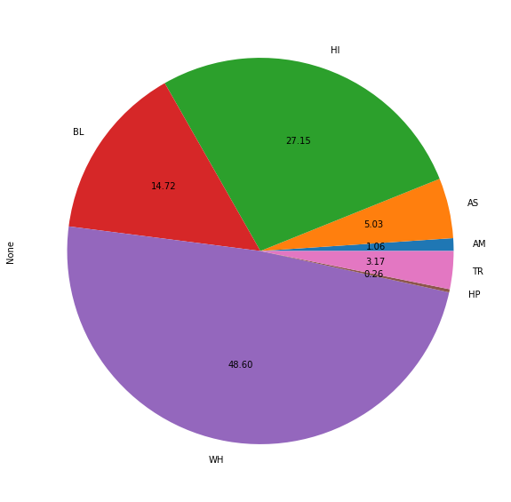
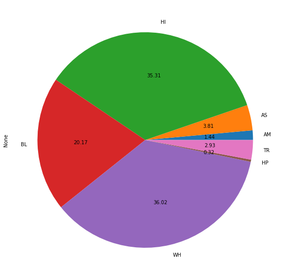

```python
import pandas as pd
import matplotlib.pyplot as plt
import numpy as np
```


```python
fiscal_df = pd.read_csv('data/Sdf16_1a.txt', sep = '\t')
rla_df = pd.read_csv('data/rla-achievement-lea-sy2015-16.csv', sep = ',')
math_df = pd.read_csv('data/math-achievement-lea-sy2015-16.csv', sep = ',')

membership_df = pd.read_csv('data/ccd_lea_052_1516_w_1a_011717.csv', sep = ',')
```

    /usr/local/lib/python3.5/dist-packages/IPython/core/interactiveshell.py:3058: DtypeWarning: Columns (0,3) have mixed types. Specify dtype option on import or set low_memory=False.
      interactivity=interactivity, compiler=compiler, result=result)
    /usr/local/lib/python3.5/dist-packages/IPython/core/interactiveshell.py:3058: DtypeWarning: Columns (17,45,129,143) have mixed types. Specify dtype option on import or set low_memory=False.
      interactivity=interactivity, compiler=compiler, result=result)
    /usr/local/lib/python3.5/dist-packages/IPython/core/interactiveshell.py:3058: DtypeWarning: Columns (17) have mixed types. Specify dtype option on import or set low_memory=False.
      interactivity=interactivity, compiler=compiler, result=result)
    /usr/local/lib/python3.5/dist-packages/IPython/core/interactiveshell.py:3058: DtypeWarning: Columns (6) have mixed types. Specify dtype option on import or set low_memory=False.
      interactivity=interactivity, compiler=compiler, result=result)


```python
fiscal_df
```


<div>
<style scoped>
    .dataframe tbody tr th:only-of-type {
        vertical-align: middle;
    }

    .dataframe tbody tr th {
        vertical-align: top;
    }

    .dataframe thead th {
        text-align: right;
    }
</style>
<table border="1" class="dataframe">
  <thead>
    <tr style="text-align: right;">
      <th></th>
      <th>LEAID</th>
      <th>CENSUSID</th>
      <th>FIPST</th>
      <th>CONUM</th>
      <th>CSA</th>
      <th>CBSA</th>
      <th>NAME</th>
      <th>STNAME</th>
      <th>STABBR</th>
      <th>SCHLEV</th>
      <th>...</th>
      <th>FL_61V</th>
      <th>FL_66V</th>
      <th>FL_W01</th>
      <th>FL_W31</th>
      <th>FL_W61</th>
      <th>FL_V95</th>
      <th>FL_V02</th>
      <th>FL_K14</th>
      <th>FL_CE1</th>
      <th>FL_CE2</th>
    </tr>
  </thead>
  <tbody>
    <tr>
      <th>0</th>
      <td>100002</td>
      <td>N</td>
      <td>1</td>
      <td>01073</td>
      <td>142</td>
      <td>13820</td>
      <td>Alabama Youth Services</td>
      <td>Alabama</td>
      <td>AL</td>
      <td>N</td>
      <td>...</td>
      <td>M</td>
      <td>M</td>
      <td>M</td>
      <td>M</td>
      <td>M</td>
      <td>M</td>
      <td>M</td>
      <td>M</td>
      <td>M</td>
      <td>M</td>
    </tr>
    <tr>
      <th>1</th>
      <td>100005</td>
      <td>01504840100000</td>
      <td>1</td>
      <td>01095</td>
      <td>290</td>
      <td>10700</td>
      <td>Albertville City</td>
      <td>Alabama</td>
      <td>AL</td>
      <td>03</td>
      <td>...</td>
      <td>M</td>
      <td>M</td>
      <td>R</td>
      <td>R</td>
      <td>R</td>
      <td>M</td>
      <td>M</td>
      <td>M</td>
      <td>M</td>
      <td>M</td>
    </tr>
    <tr>
      <th>2</th>
      <td>100006</td>
      <td>01504800100000</td>
      <td>1</td>
      <td>01095</td>
      <td>290</td>
      <td>10700</td>
      <td>Marshall County</td>
      <td>Alabama</td>
      <td>AL</td>
      <td>03</td>
      <td>...</td>
      <td>M</td>
      <td>M</td>
      <td>R</td>
      <td>R</td>
      <td>R</td>
      <td>M</td>
      <td>M</td>
      <td>M</td>
      <td>M</td>
      <td>M</td>
    </tr>
    <tr>
      <th>3</th>
      <td>100007</td>
      <td>01503740100000</td>
      <td>1</td>
      <td>01073</td>
      <td>142</td>
      <td>13820</td>
      <td>Hoover City</td>
      <td>Alabama</td>
      <td>AL</td>
      <td>03</td>
      <td>...</td>
      <td>M</td>
      <td>M</td>
      <td>R</td>
      <td>R</td>
      <td>R</td>
      <td>M</td>
      <td>M</td>
      <td>M</td>
      <td>M</td>
      <td>M</td>
    </tr>
    <tr>
      <th>4</th>
      <td>100008</td>
      <td>01504530100000</td>
      <td>1</td>
      <td>01089</td>
      <td>290</td>
      <td>26620</td>
      <td>Madison City</td>
      <td>Alabama</td>
      <td>AL</td>
      <td>03</td>
      <td>...</td>
      <td>M</td>
      <td>M</td>
      <td>R</td>
      <td>R</td>
      <td>R</td>
      <td>M</td>
      <td>M</td>
      <td>M</td>
      <td>M</td>
      <td>M</td>
    </tr>
    <tr>
      <th>...</th>
      <td>...</td>
      <td>...</td>
      <td>...</td>
      <td>...</td>
      <td>...</td>
      <td>...</td>
      <td>...</td>
      <td>...</td>
      <td>...</td>
      <td>...</td>
      <td>...</td>
      <td>...</td>
      <td>...</td>
      <td>...</td>
      <td>...</td>
      <td>...</td>
      <td>...</td>
      <td>...</td>
      <td>...</td>
      <td>...</td>
      <td>...</td>
    </tr>
    <tr>
      <th>18703</th>
      <td>5680250</td>
      <td>51502040100000</td>
      <td>56</td>
      <td>56039</td>
      <td>N</td>
      <td>27220</td>
      <td>Region V BOCES</td>
      <td>Wyoming</td>
      <td>WY</td>
      <td>07</td>
      <td>...</td>
      <td>N</td>
      <td>N</td>
      <td>N</td>
      <td>N</td>
      <td>N</td>
      <td>N</td>
      <td>N</td>
      <td>N</td>
      <td>N</td>
      <td>N</td>
    </tr>
    <tr>
      <th>18704</th>
      <td>5680251</td>
      <td>N</td>
      <td>56</td>
      <td>56021</td>
      <td>N</td>
      <td>16940</td>
      <td>Wyoming Department of Family Services</td>
      <td>Wyoming</td>
      <td>WY</td>
      <td>N</td>
      <td>...</td>
      <td>N</td>
      <td>N</td>
      <td>N</td>
      <td>N</td>
      <td>N</td>
      <td>N</td>
      <td>N</td>
      <td>N</td>
      <td>N</td>
      <td>N</td>
    </tr>
    <tr>
      <th>18705</th>
      <td>5680252</td>
      <td>N</td>
      <td>56</td>
      <td>56005</td>
      <td>N</td>
      <td>23940</td>
      <td>Youth Emergency Services Inc. - Administration...</td>
      <td>Wyoming</td>
      <td>WY</td>
      <td>N</td>
      <td>...</td>
      <td>N</td>
      <td>N</td>
      <td>N</td>
      <td>N</td>
      <td>N</td>
      <td>N</td>
      <td>N</td>
      <td>N</td>
      <td>N</td>
      <td>N</td>
    </tr>
    <tr>
      <th>18706</th>
      <td>5680253</td>
      <td>N</td>
      <td>56</td>
      <td>56025</td>
      <td>N</td>
      <td>16220</td>
      <td>Wyoming Behavioral Institute - Administration ...</td>
      <td>Wyoming</td>
      <td>WY</td>
      <td>N</td>
      <td>...</td>
      <td>N</td>
      <td>N</td>
      <td>N</td>
      <td>N</td>
      <td>N</td>
      <td>N</td>
      <td>N</td>
      <td>N</td>
      <td>N</td>
      <td>N</td>
    </tr>
    <tr>
      <th>18707</th>
      <td>5680254</td>
      <td>N</td>
      <td>56</td>
      <td>56013</td>
      <td>N</td>
      <td>40180</td>
      <td>Saint Stephen's Indian School Admin Office</td>
      <td>Wyoming</td>
      <td>WY</td>
      <td>03</td>
      <td>...</td>
      <td>N</td>
      <td>N</td>
      <td>N</td>
      <td>N</td>
      <td>N</td>
      <td>N</td>
      <td>N</td>
      <td>N</td>
      <td>N</td>
      <td>N</td>
    </tr>
  </tbody>
</table>
<p>18708 rows × 260 columns</p>
</div>


```python
fiscal_df['TFEDREV'].sum() * .15
```


    8340410870.7


```python
to_cut = fiscal_df['TFEDREV'].sum() * .15
tocut_df = fiscal_df[['LEAID','TOTALEXP','V33', 'STNAME', 'NAME', 'TFEDREV']]
tocut_df = tocut_df[(tocut_df['TFEDREV'] > 0) & (tocut_df['V33'] > 0)]
tocut_df['percapita_spending'] = tocut_df['TFEDREV']/tocut_df['V33']
```


```python
for i, v in tocut_df.sort_values('percapita_spending', ascending = False).iterrows():
    
    if ((to_cut - (v['TFEDREV'] * .20)) > 0):
        
        #print('to_cut: %f' % (v['TFEDREV'] * .20))
        #print('remaning %f' % to_cut)
        #print('\n')
        
        tocut_df.loc[i, 'to_cut'] = v['TFEDREV'] * .20
        to_cut -= (v['TFEDREV'] * .20)


        tocut_df.loc[i, 'STNAME'] = v['STNAME']
        tocut_df.loc[i, 'NAME'] = v['NAME']
        
    else:
        tocut_df.loc[i, 'to_cut'] = 0
```

## Problem 1

For the districts you selected for budget cuts in HW 3 Problem 4, calculate and visualize the proportion of each district’s total funding that will be lost.
Which districts will be affected by your budget cuts the most?


#### According to my solution majority of the districts recieve no budget cuts. The distribution appears to be log normal. Further the distribution of percentage of budget cuts follows a bimodal distribution with most districts receiving 0 budget cuts.


```python
plt.figure()
tocut_df['to_cut'].plot.hist(bins = 100, log = True, figsize = (15,10))
plt.ylabel('Count of Districts for a given amount of budget cut')
plt.xlabel('Amount of Budget Cut')
```


    Text(0.5, 0, 'Amount of Budget Cut')


```python
(tocut_df['to_cut']/tocut_df['TOTALEXP']).plot.hist(figsize = (15,10))
```


    <matplotlib.axes._subplots.AxesSubplot at 0x7fb654c07208>


## Problem 2

A common problem with purely data-driven solutions is that they can inadvertently perpetuate hidden pre-existing biases in the data, and further disadvantage groups that are already disadvantaged.
Calculate the proportion of enrolled students by race for each district, then visualize the distributions of these for districts that received budget cuts versus districts that did not receive budget cuts.
Comment on whether the the distributions appear to be the same or different. Did your selection include any hidden biases, or manage to avoid them?

### It appears my strategy of cutting the budgets of districts that have higher per capita expenditures backfired as it appears that the higher per capita spending was targetted at minorities. Of the districts that saw a budget cut, we see higher representation of minorities, For Example: 35% Hispanics (up from 27%) , 20% African Americans (up from 14%). Asians appear to be the only minority demographic whose representation has gone down in the budget cuts.


```python
tocut_df = pd.merge(tocut_df, membership_df[['LEAID', 'TOTAL', 'AM', 'AS','HI', 'BL', 'WH', 'HP', 'TR']])
```


```python
tocut_df['BL_proportion'] = tocut_df['BL'] / tocut_df['TOTAL']
tocut_df['AM_proportion'] = tocut_df['AM'] / tocut_df['TOTAL']
tocut_df['HP_proportion'] = tocut_df['HP'] / tocut_df['TOTAL']
tocut_df['AS_proportion'] = tocut_df['AS'] / tocut_df['TOTAL']
tocut_df['WH_proportion'] = tocut_df['WH'] / tocut_df['TOTAL']
tocut_df['HI_proportion'] = tocut_df['HI'] / tocut_df['TOTAL']
tocut_df['TR_proportion'] = tocut_df['TR'] / tocut_df['TOTAL']
```

### Proportion of Students across the whole dataset


```python
tocut_df[['AM', 'AS','HI', 'BL', 'WH', 'HP', 'TR']].sum().plot.pie(autopct='%.2f', figsize = (10, 10))
```


    <matplotlib.axes._subplots.AxesSubplot at 0x7fb6624c27b8>





### Proportion of Students that recieved a budget cut


```python
tocut_df[tocut_df['to_cut'] > 0][['AM', 'AS','HI', 'BL', 'WH', 'HP', 'TR']].sum().plot.pie(autopct='%.2f', figsize = (10, 10))
```


    <matplotlib.axes._subplots.AxesSubplot at 0x7fb654ba12b0>





### Proportion of Students that did not recieve a budget cut


```python
tocut_df[tocut_df['to_cut'] == 0][['AM', 'AS','HI', 'BL', 'WH', 'HP', 'TR']].sum().plot.pie(autopct='%.2f', figsize = (10, 10))
```


    <matplotlib.axes._subplots.AxesSubplot at 0x7fb654cc31d0>


## Problem 3: 
Calculate the proportion of enrolled students by disability status (students with an IEP under IDEA) for each district, then visualize the distributions of these proportions for districts that received budget cuts versus districts that did not receive budget cuts.Comment on whether the the distributions appear to be the same or different. Did your selection include any hidden biases, or manage to avoid them?

### It appears that my solution has the same effect on disabled and non-disabled students alike.


```python
disabled_df = pd.read_csv('data/ccd_lea_002089_1516_w_1a_011717.csv')
```


```python
disabled_df = pd.merge(tocut_df, disabled_df)
```


```python
disabled_df['dis_proportion'] = disabled_df['SPECED'] / disabled_df['TOTAL']
```


```python
disabled_df['disabled'] = disabled_df['SPECED']
```


```python
disabled_df['not_disabled'] = disabled_df['TOTAL'] - disabled_df['SPECED']
```

### Proportion of disabled students across the whole dataset


```python
disabled_df[['disabled', 'not_disabled']].sum().plot.pie(autopct='%.2f', figsize = (10, 10))
```


    <matplotlib.axes._subplots.AxesSubplot at 0x7fb65cb24c18>


### Proportion of disabled students recieving a budget cut


```python
disabled_df[disabled_df['to_cut'] > 0][['disabled', 'not_disabled']].sum().plot.pie(autopct='%.2f', figsize = (10, 10))
```


    <matplotlib.axes._subplots.AxesSubplot at 0x7fb65cb8c860>


### Problem 4
Choose and critique one of your fellow classmates’ selection of schools for budget cuts in HW 3 Problem 4 and Problem 5. What was the justification of their selection? Discuss any advantages or disadvantages of their approach.


#### I choose Sarthak Kothari's strategy for budget cut. His method appears to be the one least likely to hurt overall as the it minimizes the fiscal panalty for schools that are already not doing so well. Furthermore, it's more nuanced since it's looking at proficiency. On the downside however, it might not be the most fair way as the schools that might be working hard to to achieve profeciency are the ones being penalised the most.

### Problem 5

The mapreduce lecture was very helpful in that it helped us breakdown a very useful framework into it's essential components. This allowed us to get an intuitive sense of what the framework was all about and go and explore firther if neccesary. Furthermore it also allowed me to do well in an inteview recently as well.


```python

```
